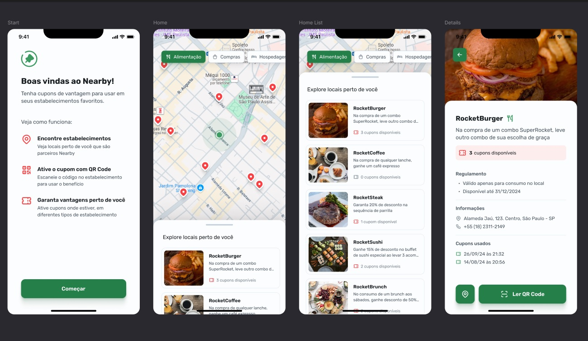

<p align="center">
    
</p>
<p align="center"><h1 align="center">NLW-POCKET-MOBILE</h1></p>
<p align="center">
	<em>Code with harmony, build with precision.</em>
</p>
<p align="center">
	
	
	
	
</p>
<p align="center"><!-- default option, no dependency badges. -->
</p>
<p align="center">
	<!-- default option, no dependency badges. -->
</p>
<br>

## 🔗 Table of Contents

- [📍 Overview](#-overview)
- [👾 Features](#-features)
- [📁 Project Structure](#-project-structure)
  - [📂 Project Index](#-project-index)
- [🚀 Getting Started](#-getting-started)
  - [☑️ Prerequisites](#-prerequisites)
  - [⚙️ Installation](#-installation)
  - [🤖 Usage](#🤖-usage)
  - [🧪 Testing](#🧪-testing)
- [📌 Project Roadmap](#-project-roadmap)
- [🔰 Contributing](#-contributing)


---

## 📍 Overview

Nearby is a cutting-edge solution that streamlines the browsing and redemption of coupons at nearby markets. With intuitive features like dynamic market views and seamless QR code scanning, this app enhances user experience and promotes local business engagement. Ideal for shoppers seeking convenient discounts and businesses looking to boost foot traffic.



---

## 👾 Features

|      | Feature         | Summary       |
| :--- | :---:           | :---          |
| ⚙️  | **Architecture**  | <ul><li>Utilizes **TypeScript** for type safety and enhanced developer experience</li><li>Follows a **modular** structure with components organized into separate files for maintainability</li><li>Leverages **Expo** for cross-platform development and access to native APIs</li></ul> |
| 🔩 | **Code Quality**  | <ul><li>Strict compiler options defined in **tsconfig.json** for robust type checking</li><li>Consistent coding style and formatting maintained across the codebase</li><li>Utilizes **React Native** best practices for efficient and performant code</li></ul> |
| 📄 | **Documentation** | <ul><li>Comprehensive documentation in **TypeScript** files for clear understanding of code functionality</li><li>Detailed **package.json** and **package-lock.json** for dependency management</li><li>Inline comments and JSDoc annotations for improved code readability</li></ul> |
| 🔌 | **Integrations**  | <ul><li>Integrates with **Axios** for backend communication</li><li>Utilizes **Expo** libraries for features like camera access and location services</li><li>Seamless integration with **React Navigation** for navigation within the app</li></ul> |
| 🧩 | **Modularity**    | <ul><li>Components organized into separate files for **reusability** and **maintainability**</li><li>Utilizes **Expo Router** for efficient navigation between screens</li><li>Encapsulates UI elements into **reusable components** for codebase modularity</li></ul> |
| ⚡️  | **Performance**   | <ul><li>Optimized codebase for **smooth rendering** and **fast interactions**</li><li>Utilizes **React Native Reanimated** for high-performance animations</li><li>Efficient handling of **asynchronous operations** for improved user experience</li></ul> |
| 🛡️ | **Security**      | <ul><li>Implements secure communication with backend using **Axios**</li><li>Handles **camera permissions** and **QR code scanning** securely</li><li>Follows best practices for **data encryption** and **secure storage**</li></ul> |
| 📦 | **Dependencies**  | <ul><li>Includes essential dependencies like **@expo/vector-icons**, **@gorhom/bottom-sheet**, and **@react-navigation/native**</li><li>Consistent dependency versions maintained in **package-lock.json** for stability</li><li>Utilizes **Expo** and **React Native** libraries for enhanced functionality</li></ul> |

---

## 📁 Project Structure

```sh
└── NLW-Pocket-Mobile/
    ├── app.json
    ├── assets
    │   └── images
    ├── package-lock.json
    ├── package.json
    ├── src
    │   ├── app
    │   ├── assets
    │   ├── components
    │   ├── services
    │   ├── styles
    │   └── utils
    └── tsconfig.json
```


### 📂 Project Index
<details open>
	<summary><b><code>NLW-POCKET-MOBILE/</code></b></summary>
	<details> <!-- __root__ Submodule -->
		<summary><b>__root__</b></summary>
		<blockquote>
			<table>
			<tr>
				<td><b><a href='https://github.com/Drlazinho/NLW-Pocket-Mobile/blob/master/package-lock.json'>package-lock.json</a></b></td>
				<td>- SUMMARY:
The `package-lock.json` file in the project structure defines the dependencies required for the "nearby" application<br>- It ensures that the correct versions of external libraries like "@expo-google-fonts/rubik", "@expo/vector-icons", "@gorhom/bottom-sheet", "@react-navigation/native", "@tabler/core", and "@tabler/icons-react" are used, maintaining consistency and stability in the codebase architecture.</td>
			</tr>
			<tr>
				<td><b><a href='https://github.com/Drlazinho/NLW-Pocket-Mobile/blob/master/app.json'>app.json</a></b></td>
				<td>- Define the project configuration for the 'nearby' app, specifying details like name, version, orientation, icons, and platform-specific settings<br>- The file sets up essential parameters for the app's appearance and behavior across different devices and platforms, ensuring a consistent user experience.</td>
			</tr>
			<tr>
				<td><b><a href='https://github.com/Drlazinho/NLW-Pocket-Mobile/blob/master/tsconfig.json'>tsconfig.json</a></b></td>
				<td>Defines strict compiler options and path mappings for TypeScript files in the project, ensuring type safety and module resolution.</td>
			</tr>
			<tr>
				<td><b><a href='https://github.com/Drlazinho/NLW-Pocket-Mobile/blob/master/package.json'>package.json</a></b></td>
				<td>- Define the project's main functionality and structure by examining the package.json file<br>- Identify dependencies, scripts, and configurations essential for the project's operation<br>- This analysis aids in understanding the project's setup and requirements, guiding further development and maintenance efforts.</td>
			</tr>
			</table>
		</blockquote>
	</details>
	<details> <!-- src Submodule -->
		<summary><b>src</b></summary>
		<blockquote>
			<details>
				<summary><b>styles</b></summary>
				<blockquote>
					<table>
					<tr>
						<td><b><a href='https://github.com/Drlazinho/NLW-Pocket-Mobile/blob/master/src/styles/colors.ts'>colors.ts</a></b></td>
						<td>- Define color palettes for the project's UI components, ensuring consistent and harmonious visual styling<br>- The colors module centralizes color definitions, promoting maintainability and ease of updating across the codebase.</td>
					</tr>
					<tr>
						<td><b><a href='https://github.com/Drlazinho/NLW-Pocket-Mobile/blob/master/src/styles/font-family.ts'>font-family.ts</a></b></td>
						<td>Define font family styles for the project using named font weights for consistency and easy maintenance across the codebase.</td>
					</tr>
					<tr>
						<td><b><a href='https://github.com/Drlazinho/NLW-Pocket-Mobile/blob/master/src/styles/theme.ts'>theme.ts</a></b></td>
						<td>Exports color and font family styles for the project's theming system, enhancing consistency and maintainability across the codebase architecture.</td>
					</tr>
					</table>
				</blockquote>
			</details>
			<details>
				<summary><b>components</b></summary>
				<blockquote>
					<details>
						<summary><b>market</b></summary>
						<blockquote>
							<details>
								<summary><b>cover</b></summary>
								<blockquote>
									<table>
									<tr>
										<td><b><a href='https://github.com/Drlazinho/NLW-Pocket-Mobile/blob/master/src/components/market/cover/styles.ts'>styles.ts</a></b></td>
										<td>- Define styles for the market cover component, ensuring consistent visual presentation across the app<br>- The styles include container dimensions, background color, and header padding, enhancing the market section's aesthetic appeal and user experience.</td>
									</tr>
									<tr>
										<td><b><a href='https://github.com/Drlazinho/NLW-Pocket-Mobile/blob/master/src/components/market/cover/index.tsx'>index.tsx</a></b></td>
										<td>- Implements a cover component for the market section, displaying an image background with a back button<br>- The component utilizes React Native elements and Expo Router for navigation.</td>
									</tr>
									</table>
								</blockquote>
							</details>
							<details>
								<summary><b>coupon</b></summary>
								<blockquote>
									<table>
									<tr>
										<td><b><a href='https://github.com/Drlazinho/NLW-Pocket-Mobile/blob/master/src/components/market/coupon/styles.ts'>styles.ts</a></b></td>
										<td>- Define visual styles for market coupon components using React Native StyleSheet<br>- Set container padding, title styling, content layout, and code appearance with specific colors and fonts.</td>
									</tr>
									<tr>
										<td><b><a href='https://github.com/Drlazinho/NLW-Pocket-Mobile/blob/master/src/components/market/coupon/index.tsx'>index.tsx</a></b></td>
										<td>- The Coupon component renders a styled view displaying a coupon code with an accompanying icon<br>- It enhances the user interface by providing a visually appealing representation of a coupon for utilization within the market section of the application.</td>
									</tr>
									</table>
								</blockquote>
							</details>
							<details>
								<summary><b>details</b></summary>
								<blockquote>
									<table>
									<tr>
										<td><b><a href='https://github.com/Drlazinho/NLW-Pocket-Mobile/blob/master/src/components/market/details/styles.ts'>styles.ts</a></b></td>
										<td>Define styles for market details component to ensure consistent visual presentation across the app.</td>
									</tr>
									<tr>
										<td><b><a href='https://github.com/Drlazinho/NLW-Pocket-Mobile/blob/master/src/components/market/details/index.tsx'>index.tsx</a></b></td>
										<td>- The Details component renders information about a market, including its name, description, address, phone number, available coupons, and rules<br>- It utilizes various icons to represent different pieces of information and organizes the data in a visually appealing manner for display within the market details section of the application.</td>
									</tr>
									</table>
								</blockquote>
							</details>
							<details>
								<summary><b>info</b></summary>
								<blockquote>
									<table>
									<tr>
										<td><b><a href='https://github.com/Drlazinho/NLW-Pocket-Mobile/blob/master/src/components/market/info/styles.ts'>styles.ts</a></b></td>
										<td>Define styles for market information display in the React Native app, ensuring consistent design and layout.</td>
									</tr>
									<tr>
										<td><b><a href='https://github.com/Drlazinho/NLW-Pocket-Mobile/blob/master/src/components/market/info/index.tsx'>index.tsx</a></b></td>
										<td>- Defines a reusable component for displaying information with an icon and description in a React Native app<br>- The component renders the provided icon and description within a styled container<br>- This enhances the project's architecture by promoting code reusability and maintaining a consistent UI design across different parts of the application.</td>
									</tr>
									</table>
								</blockquote>
							</details>
						</blockquote>
					</details>
					<details>
						<summary><b>category</b></summary>
						<blockquote>
							<table>
							<tr>
								<td><b><a href='https://github.com/Drlazinho/NLW-Pocket-Mobile/blob/master/src/components/category/styles.ts'>styles.ts</a></b></td>
								<td>- Define styles for the category component, including container and name styles, to ensure consistent visual presentation across the application<br>- The styles define the appearance of the category component, such as background color, border, font size, and color, enhancing the user interface's overall look and feel.</td>
							</tr>
							<tr>
								<td><b><a href='https://github.com/Drlazinho/NLW-Pocket-Mobile/blob/master/src/components/category/index.tsx'>index.tsx</a></b></td>
								<td>- The Category component renders a pressable UI element displaying a category name and icon<br>- It dynamically adjusts styles based on whether the category is selected<br>- This component enhances user interaction by providing a visually appealing way to select categories within the application.</td>
							</tr>
							</table>
						</blockquote>
					</details>
					<details>
						<summary><b>step</b></summary>
						<blockquote>
							<table>
							<tr>
								<td><b><a href='https://github.com/Drlazinho/NLW-Pocket-Mobile/blob/master/src/components/step/styles.ts'>styles.ts</a></b></td>
								<td>- Define styles for a step component, ensuring consistent design across the project<br>- The styles include container layout, title, and description formatting to maintain a cohesive visual presentation.</td>
							</tr>
							<tr>
								<td><b><a href='https://github.com/Drlazinho/NLW-Pocket-Mobile/blob/master/src/components/step/index.tsx'>index.tsx</a></b></td>
								<td>- Define a reusable Step component that displays a title, description, and an icon in a structured layout<br>- The component enhances codebase modularity and readability by encapsulating these UI elements.</td>
							</tr>
							</table>
						</blockquote>
					</details>
					<details>
						<summary><b>place</b></summary>
						<blockquote>
							<table>
							<tr>
								<td><b><a href='https://github.com/Drlazinho/NLW-Pocket-Mobile/blob/master/src/components/place/styles.ts'>styles.ts</a></b></td>
								<td>- Define styles for a place component, specifying layout, colors, and typography<br>- The styles ensure consistent visual presentation across the app, enhancing user experience and maintaining brand identity.</td>
							</tr>
							<tr>
								<td><b><a href='https://github.com/Drlazinho/NLW-Pocket-Mobile/blob/master/src/components/place/index.tsx'>index.tsx</a></b></td>
								<td>- Defines a reusable React Native component for displaying place details, including name, description, coupons, cover image, and address<br>- Utilizes TouchableOpacity for interactivity and styling from a separate file<br>- The component enhances user experience by presenting essential information in an engaging layout.</td>
							</tr>
							</table>
						</blockquote>
					</details>
					<details>
						<summary><b>categories</b></summary>
						<blockquote>
							<table>
							<tr>
								<td><b><a href='https://github.com/Drlazinho/NLW-Pocket-Mobile/blob/master/src/components/categories/styles.ts'>styles.ts</a></b></td>
								<td>- Defines styles for the categories component, ensuring proper layout and spacing<br>- The code sets specific attributes like container height and content padding, enhancing the visual presentation of the categories section within the app.</td>
							</tr>
							<tr>
								<td><b><a href='https://github.com/Drlazinho/NLW-Pocket-Mobile/blob/master/src/components/categories/index.tsx'>index.tsx</a></b></td>
								<td>- Enables rendering a horizontal list of categories with icons and names, allowing users to select a category<br>- The component receives category data, the selected category ID, and a function to handle category selection<br>- It leverages a FlatList component to display categories in a scrollable manner, enhancing user experience within the application.</td>
							</tr>
							</table>
						</blockquote>
					</details>
					<details>
						<summary><b>welcome</b></summary>
						<blockquote>
							<table>
							<tr>
								<td><b><a href='https://github.com/Drlazinho/NLW-Pocket-Mobile/blob/master/src/components/welcome/styles.ts'>styles.ts</a></b></td>
								<td>Define styles for the welcome screen components using predefined colors and font styles.</td>
							</tr>
							<tr>
								<td><b><a href='https://github.com/Drlazinho/NLW-Pocket-Mobile/blob/master/src/components/welcome/index.tsx'>index.tsx</a></b></td>
								<td>- Defines the Welcome component rendering a logo and welcoming text in a React Native app<br>- Displays a logo and greeting message to users, enhancing the user experience and branding of the application.</td>
							</tr>
							</table>
						</blockquote>
					</details>
					<details>
						<summary><b>places</b></summary>
						<blockquote>
							<table>
							<tr>
								<td><b><a href='https://github.com/Drlazinho/NLW-Pocket-Mobile/blob/master/src/components/places/styles.ts'>styles.ts</a></b></td>
								<td>Define styles for places component to ensure consistent visual presentation across the application.</td>
							</tr>
							<tr>
								<td><b><a href='https://github.com/Drlazinho/NLW-Pocket-Mobile/blob/master/src/components/places/index.tsx'>index.tsx</a></b></td>
								<td>- Enables displaying a list of places with interactive bottom sheet functionality for a mobile app<br>- Utilizes React Native components for smooth user experience<br>- Integrates routing for seamless navigation to detailed place views<br>- Enhances user engagement by showcasing nearby locations dynamically.</td>
							</tr>
							</table>
						</blockquote>
					</details>
					<details>
						<summary><b>loading</b></summary>
						<blockquote>
							<table>
							<tr>
								<td><b><a href='https://github.com/Drlazinho/NLW-Pocket-Mobile/blob/master/src/components/loading/styles.ts'>styles.ts</a></b></td>
								<td>Define styles for a loading component that centers content and sets a gray background.</td>
							</tr>
							<tr>
								<td><b><a href='https://github.com/Drlazinho/NLW-Pocket-Mobile/blob/master/src/components/loading/index.tsx'>index.tsx</a></b></td>
								<td>- Implements a loading component using an ActivityIndicator from react-native<br>- Displays a loading spinner with a green color theme, enhancing user experience during data fetching operations.</td>
							</tr>
							</table>
						</blockquote>
					</details>
					<details>
						<summary><b>button</b></summary>
						<blockquote>
							<table>
							<tr>
								<td><b><a href='https://github.com/Drlazinho/NLW-Pocket-Mobile/blob/master/src/components/button/styles.ts'>styles.ts</a></b></td>
								<td>- Defines button styles for a React Native component, setting height, color, and font properties<br>- Utilizes a centralized theme for colors and fonts<br>- Maintains consistency in UI elements across the project.</td>
							</tr>
							<tr>
								<td><b><a href='https://github.com/Drlazinho/NLW-Pocket-Mobile/blob/master/src/components/button/index.tsx'>index.tsx</a></b></td>
								<td>- The Button component in the provided code file facilitates interactive user actions by displaying customizable text or icons<br>- It includes features like loading indicators and styling options<br>- This component enhances the user interface by offering a versatile and engaging button element within the project's architecture.</td>
							</tr>
							</table>
						</blockquote>
					</details>
					<details>
						<summary><b>steps</b></summary>
						<blockquote>
							<table>
							<tr>
								<td><b><a href='https://github.com/Drlazinho/NLW-Pocket-Mobile/blob/master/src/components/steps/styles.ts'>styles.ts</a></b></td>
								<td>Define styles for steps component, ensuring consistent design across the app.</td>
							</tr>
							<tr>
								<td><b><a href='https://github.com/Drlazinho/NLW-Pocket-Mobile/blob/master/src/components/steps/index.tsx'>index.tsx</a></b></td>
								<td>- Defines a component rendering a series of steps for users to follow, showcasing key features of the app<br>- Displays icons and descriptions for each step, guiding users through the process<br>- This component enhances user onboarding and engagement by visually presenting essential actions.</td>
							</tr>
							</table>
						</blockquote>
					</details>
				</blockquote>
			</details>
			<details>
				<summary><b>utils</b></summary>
				<blockquote>
					<table>
					<tr>
						<td><b><a href='https://github.com/Drlazinho/NLW-Pocket-Mobile/blob/master/src/utils/categories-icons.ts'>categories-icons.ts</a></b></td>
						<td>Define category icons for various items using specific icons from the Tabler Icons library.</td>
					</tr>
					</table>
				</blockquote>
			</details>
			<details>
				<summary><b>services</b></summary>
				<blockquote>
					<table>
					<tr>
						<td><b><a href='https://github.com/Drlazinho/NLW-Pocket-Mobile/blob/master/src/services/api.ts'>api.ts</a></b></td>
						<td>Enables communication with the backend server by creating an instance of Axios with a specified base URL.</td>
					</tr>
					</table>
				</blockquote>
			</details>
			<details>
				<summary><b>app</b></summary>
				<blockquote>
					<table>
					<tr>
						<td><b><a href='https://github.com/Drlazinho/NLW-Pocket-Mobile/blob/master/src/app/home.tsx'>home.tsx</a></b></td>
						<td>- Generates a dynamic map interface displaying categorized markets with detailed information<br>- Fetches categories and markets from an API, sets user's current location, and allows navigation to individual market details<br>- Utilizes React Native, Expo, and React hooks for seamless user experience.</td>
					</tr>
					<tr>
						<td><b><a href='https://github.com/Drlazinho/NLW-Pocket-Mobile/blob/master/src/app/_layout.tsx'>_layout.tsx</a></b></td>
						<td>- Defines the app's main layout structure, ensuring a seamless user experience by handling font loading and setting up a consistent design theme<br>- It leverages Expo and React Native libraries for font management and gesture handling, enhancing the overall visual appeal and usability of the application.</td>
					</tr>
					<tr>
						<td><b><a href='https://github.com/Drlazinho/NLW-Pocket-Mobile/blob/master/src/app/index.tsx'>index.tsx</a></b></td>
						<td>- Defines the main screen layout and user interaction flow by rendering essential components like Welcome, Steps, and Button<br>- Handles navigation to the home screen upon button press using the Expo router<br>- This file orchestrates the initial user experience and sets the foundation for further navigation and interaction within the application.</td>
					</tr>
					</table>
					<details>
						<summary><b>market</b></summary>
						<blockquote>
							<table>
							<tr>
								<td><b><a href='https://github.com/Drlazinho/NLW-Pocket-Mobile/blob/master/src/app/market/[id].tsx'>[id].tsx</a></b></td>
								<td>- Implements a dynamic market view with coupon redemption functionality<br>- Fetches market data, displays cover and details, and allows users to scan QR codes to redeem coupons<br>- Handles camera permissions, coupon fetching, and modal interactions<br>- Ensures smooth user experience with loading indicators and error alerts.</td>
							</tr>
							</table>
						</blockquote>
					</details>
				</blockquote>
			</details>
		</blockquote>
	</details>
</details>

---
## 🚀 Getting Started

### ☑️ Prerequisites

Before getting started with NLW-Pocket-Mobile, ensure your runtime environment meets the following requirements:

- **Programming Language:** TypeScript
- **Package Manager:** Npm


### ⚙️ Installation

Install NLW-Pocket-Mobile using one of the following methods:

**Build from source:**

1. Clone the NLW-Pocket-Mobile repository:
```sh
❯ git clone https://github.com/Drlazinho/NLW-Pocket-Mobile
```

2. Navigate to the project directory:
```sh
❯ cd NLW-Pocket-Mobile
```

3. Install the project dependencies:


**Using `npm`** &nbsp; [](https://www.npmjs.com/)

```sh
❯ npm install
```


### 🤖 Usage
Run NLW-Pocket-Mobile using the following command:
**Using `npm`** &nbsp; [](https://www.npmjs.com/)

```sh
❯ npm start
```

---
## 📌 Project Roadmap

- [X] **`Task 1`**: <strike>List Categories</strike>
- [X] **`Task 2`**: <strike>Implement map and device location</strike>
- [X] **`Task 3`**: <strike>List details of category items
</strike>
- [X] **`Task 4`**: <strike>Habilitar camera para ler qrcode a respeito dos cupons
</strike>


---

## 🔰 Contributing

- **💬 [Join the Discussions](https://github.com/Drlazinho/NLW-Pocket-Mobile/discussions)**: Share your insights, provide feedback, or ask questions.
- **🐛 [Report Issues](https://github.com/Drlazinho/NLW-Pocket-Mobile/issues)**: Submit bugs found or log feature requests for the `NLW-Pocket-Mobile` project.
- **💡 [Submit Pull Requests](https://github.com/Drlazinho/NLW-Pocket-Mobile/blob/main/CONTRIBUTING.md)**: Review open PRs, and submit your own PRs.

<details closed>
<summary>Contributing Guidelines</summary>

1. **Fork the Repository**: Start by forking the project repository to your github account.
2. **Clone Locally**: Clone the forked repository to your local machine using a git client.
   ```sh
   git clone https://github.com/Drlazinho/NLW-Pocket-Mobile
   ```
3. **Create a New Branch**: Always work on a new branch, giving it a descriptive name.
   ```sh
   git checkout -b new-feature-x
   ```
4. **Make Your Changes**: Develop and test your changes locally.
5. **Commit Your Changes**: Commit with a clear message describing your updates.
   ```sh
   git commit -m 'Implemented new feature x.'
   ```
6. **Push to github**: Push the changes to your forked repository.
   ```sh
   git push origin new-feature-x
   ```
7. **Submit a Pull Request**: Create a PR against the original project repository. Clearly describe the changes and their motivations.
8. **Review**: Once your PR is reviewed and approved, it will be merged into the main branch. Congratulations on your contribution!
</details>

<details closed>
<summary>Contributor Graph</summary>
<br>
<p align="left">
   <a href="https://github.com{/Drlazinho/NLW-Pocket-Mobile/}graphs/contributors">
      
   </a>
</p>
</details>

